# System Architecture Documentation

## Architecture Diagram

The following diagram shows the high-level architecture of the CSE455-Spring25-Advising service:



*Figure 1: System Architecture Diagram showing the components and their relationships*


## Overview

The CSE455-Spring25-Advising service is built using a microservices architecture with the following key components:

- FastAPI Application
- PostgreSQL Database
- Redis Cache
- Kubernetes Deployment

## Component Diagram



*Figure 2: System Component Diagram showing the components*


## Application Architecture

### Directory Structure
```
app/
├── crud/          # Database operations
├── database/      # Database configuration
├── models/        # SQLAlchemy models
├── routers/       # API endpoints
├── schemas/       # Pydantic models
└── utils/         # Utility functions
```

### Key Components

1. **API Layer (routers/)**
   - Handles HTTP requests
   - Input validation
   - Response formatting
   - Error handling

2. **Business Logic (crud/)**
   - Implements business rules
   - Database operations
   - Data validation
   - Error handling

3. **Data Models**
   - SQLAlchemy models (models/)
   - Pydantic schemas (schemas/)
   - Data validation
   - Serialization/deserialization

4. **Database Layer**
   - PostgreSQL for persistent storage
   - Redis for caching
   - Connection pooling
   - Transaction management

## Data Flow

1. **Request Flow**
   ```
   Client → API Endpoint → Request Validation → Business Logic → Database → Response
   ```

2. **Error Handling Flow**
   ```
   Error → Error Handler → Logging → Formatted Response → Client
   ```

## Database Schema

### Tables

1. **courses**
   - Primary course information
   - Core course flag
   - Level information

2. **categories**
   - Course categories
   - Category descriptions

3. **sections**
   - Course sections
   - Scheduling information
   - Capacity details

4. **prerequisites**
   - Course dependencies
   - Prerequisite relationships

## Caching Strategy

- Redis is used for caching frequently accessed data
- Cache invalidation on data updates
- TTL-based cache expiration

## Security

- Input validation
- Error handling
- Rate limiting (planned)
- Authentication (planned)

## Scalability

- Horizontal scaling through Kubernetes
- Database connection pooling
- Caching for performance
- Stateless application design

## Monitoring and Logging

- Structured logging
- Error tracking
- Performance monitoring
- Health checks

## Deployment Architecture

### Kubernetes Components

1. **Deployments**
   - FastAPI application
   - PostgreSQL database
   - Redis cache

2. **Services**
   - Load balancing
   - Service discovery
   - Internal networking

3. **ConfigMaps and Secrets**
   - Configuration management
   - Environment variables
   - Sensitive data

4. **Persistent Volumes**
   - Database storage
   - Backup storage

## Development Workflow

1. **Local Development**
   - Docker Compose for local setup
   - Hot reloading
   - Local database

2. **Testing**
   - Unit tests
   - Integration tests
   - End-to-end tests

3. **CI/CD Pipeline**
   - Automated testing
   - Docker image building
   - Kubernetes deployment

## Future Considerations

1. **Planned Features**
   - Authentication
   - Rate limiting
   - API versioning
   - Advanced search

2. **Scalability Improvements**
   - Database sharding
   - Caching improvements
   - Load balancing

3. **Monitoring Enhancements**
   - Metrics collection
   - Alerting
   - Performance optimization 